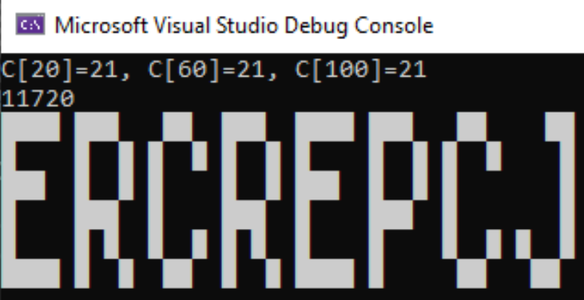

# AdventOfCode_2022
C# solutions for the 2022 Advent of Code.
[Advent of Code 2022](https://adventofcode.com)

## Day00: How to use the Read()
```csharp
// The Read extensions streams data form the console input 
//  or a given file contents to make parsing inputs really easy.
public static IEnumerable<string?> Read()
{
    var args = Environment.GetCommandLineArgs();
    var inputFile = args.Length > 1 ? args[1] : string.Empty;
    if (!string.IsNullOrEmpty(inputFile))
    {
        foreach (var line in File.ReadAllLines(inputFile))
        {
            yield return line;
        }
    }
    else
    {
        while (true)
            yield return Console.ReadLine();
    }

    // Run the example
    AdventOfCode_2022\Day01> dotnet run problem.txt
```

## Day01: An exercise in LINQ
```csharp
// How to use the Read extensions.
Read()
    .Aggregate(
        new List<List<int>>() { new() },
        (acc, calories) =>
        {
            if (string.IsNullOrEmpty(calories)) 
                acc.Add(new());
            else
                acc[^1].Add(int.Parse(calories));

            return acc;
        }, 
        acc => acc.Select(x => x.Sum()).OrderByDescending(x => x))
    .ToConsole(totals => new[]
    {
        $"Elf with the max calories is {totals.First()}",
        $"Top 3 Elves with the max calories are {totals.First()}, {totals.Second()}, {totals.Third()}",
        $"Top 3 Elves with the max calories sum is {totals.Take(3).Sum()}"
    });
```

## Day02: Rock, Paper, Scissor game engine
Given a list of matches, calculate your score.  
Read works great to read each rows of the input as a round. `Aggregate` gives an easy way to perform an operation on each round, and even provides a way to seed the starting system.

A RockPaperScissor game engine seeds the aggregate operation which performs a match evaluation on each input line.
```csharp
Read(x => x!)
    .Aggregate(
        new RockPaperScissor(),
        (game, match) => game.Evaluate(
            Shoot.From(match.Player()),
            Shoot.From(match.Opponent())))
    .ToConsole("Part One");

Read(x => x!)
    .Aggregate(
        new RockPaperScissor(),
        (game, match) =>
        {
            var them = Shoot.From(match.Opponent());
            var you = match.Player() switch
            {
                'X' => them.Wins(),
                'Y' => them.Draws(),
                'Z' => them.Loses(),
                _ => throw new NotImplementedException()
            };

            return game.Evaluate(you, them);
        })
    .ToConsole("Part Two");
```

## Day03: Linq intersections and sums.
```csharp
Read(x => x!)
    .Aggregate(0, (sum, sack) =>
        sum += sack[..(sack.Length / 2)]
            .Intersect(sack[(sack.Length / 2)..])
            .Sum(x => Value(x)))
    .ToConsole("Part One");


Read(x => x!)
    .Chunk(3)
    .Aggregate(0, (sum, batch) =>
        sum += batch.First()
            .Intersect(batch.Second())
            .Intersect(batch.Third())
            .Sum(x => Value(x)))
    .ToConsole("Part Two");
```


## Day05: A crane simulation. 
The challenge moves chars between collections. The code users `Solution` to provides 2 simple interfaces to 1) Load Data, 2) Solve a problem using the given data.

```csharp
Read()
    .SolveWith<CraneSystem>()
    .ToConsole("Part One");

var crane9001 = new CraneSystem(true);
Read()
    .SolveWith(
        prepareWith: (solver, input) => solver.Load(input),
        solveWith: crane9001)
    .ToConsole("Part Two");

```

The supporting extensions methods bring the solution together with the input stream to make the Program easier to write. 
```csharp
public static class ISolverExtensions
{
    public static TSolver SolveWith<TSolver>(this IEnumerable<string?> source, TSolver? solveWith = default)
        where TSolver : ISolve, ILoadInput, new()
            => SolveWith(source, (solver, row) => (TSolver)solver.Load(row), solveWith);

    public static TSolver SolveWith<TSolver>(this IEnumerable<string?> source, Func<TSolver, string?, TSolver> prepareWith, TSolver? solveWith = default) 
        where TSolver : ISolve, new()
    {
        solveWith ??= new TSolver();
        foreach (var row in source)
        {
            solveWith = prepareWith(solveWith, row);
        }

        solveWith.Solve();
        return solveWith;
    }
}
```

## Day 06: A string processing solution
Some times just brute forcing for an active signal makes it easy
```csharp
for (var i = 4; i < input.Length; i++)
{
    if (
        input[i - 1] != input[i - 2] &&
        input[i - 1] != input[i - 3] &&
        input[i - 1] != input[i - 4] &&
        input[i - 2] != input[i - 3] &&
        input[i - 2] != input[i - 4] &&
        input[i - 3] != input[i - 4])
    {
        answer = i;
        break;
    }
}

Console.WriteLine($"Stopped at index {answer}");
Console.WriteLine($"{input.ToString().Substring(answer - 4, 4)}");
```

Not really sure how performant the part2 solution is but I think it's `OK`
```csharp
for (var end = 14; end < input.Length - 1; end++)
{
    var hash = input[(end - 14)..end].ToImmutableArray().ToImmutableHashSet();
    if (hash.Count == 14)
    {
        partTwo = end;
        break;
    }
}
```

## Day 07: Command processor

```csharp
var treefs = new TreeFs();
Read()
    .SolveWith(solveWith: treefs)
    .ToConsole("\r\nDay 07 Solution");
```

## Day 08: Get the Grid out
Day 8 requires a grid and some basic grid ray casting.

We get to make use of the existing grid and a few extensions methods to help walk the grid.

```csharp
var grid = new Grid<int>(ReadAsRowsOfInts());
grid.Each(tree =>
{
    if (
        // Is tree on the edge?
        tree.X == 0 ||
        tree.Y == 0 ||
        tree.X == grid.Width - 1 ||
        tree.Y == grid.Width - 1 ||

        // is tree visible from edge
        grid.UpFrom(tree).All(height => height < tree.Value) ||
        grid.LeftFrom(tree).All(height => height < tree.Value) ||
        grid.DownFrom(tree).All(height => height < tree.Value) ||
        grid.RightFrom(tree).All(height => height < tree.Value))
    {
        visible++;
    }
});
```

An extension method to that supplies all the nodes Up from the give node. Enumerates the values from the current node, up, left, down, and to the right. Allows us to inspect the in a direction from a given location.
```csharp
public static IEnumerable<T> UpFrom<T>(this Grid<T> grid, Node<T> node)
{
    for (var i = node.Y - 1; i >= 0; i--)
    {
        yield return grid[node.X, i]!;
    }
}
```

We also make an inclusive version of the LINQ extension to TakeUntil something is true.
```csharp
public static IEnumerable<T> TakeUntil<T>(this IEnumerable<T> source, Func<T, bool> predicate)
{
    foreach (T item in source)
    {
        if (!predicate(item))
        {
            yield return item;
        }
        else
        {
            yield return item;
            yield break;
        }
    }
}
```

## Day 09: A physics engine with keyframe animations of a rope.

```csharp
List<(int X, int Y)[]> rope = ...

// the movement of the head knot.
foreach (var (X,Y) in movement)
{
	var knots = ((int X, int Y)[])rope[^1].Clone();
	knots[0] = (X, Y);
	rope.Add(knots);

    // The physics step for each link in the rope.
	for (var i = 1; i < knotCount; i++)
	{
		var head = knots[i - 1];
		var tail = knots[i];

		var x = head.X > tail.X ? 1 : -1;
		var y = head.Y > tail.Y ? 1 : -1;

		var distance = tail.DistanceTo(head);
		if (distance == 0 || distance == 1)
		{
			// tail is close enough
		}
		else if (distance == 2)
		{
			if (tail.X != head.X && tail.Y != head.Y)
			{
				// tail and head are diagonal.
				// tail is close enough
			}
			else if (tail.X == head.X)
			{
				// tail needs to move in the Y direction
				knots[i] = (tail.X, tail.Y + y);
			}
			else if (tail.Y == head.Y)
			{
				// tail needs to move in the X direction
				knots[i] = (tail.X + x, tail.Y);
			}
			else
			{
				Console.WriteLine($"Frame {rope.Count}: Knots:{string.Join(" ", knots)}");
				throw new UnreachableException();
			}
		}
		else if (distance == 3 || distance == 4)
		{
			// tails needs to move diagonal
			knots[i] = (tail.X + x, tail.Y + y);
		}
		else
		{
			Console.WriteLine($"Frame {rope.Count}:{string.Join(" ", knots)}");
			throw new UnreachableException($"distance is too high {distance}");
		}
	}
}
```

## Day 10: The smallest C# emulator.
Writing emulators is so fun and day 10 might be the smallest emulator with display I've ever made.
The instruction set is 2 operations and 1 is NOP! The other is add, and there is one register.
```csharp
(int Register, List<int> Cycles) start = (1, new List<int>());

var computer = Read()
    .Aggregate(start, (computer, instruction) =>
    {
        ArgumentNullException.ThrowIfNull(instruction);

        computer.Cycles.Add(computer.Register);
        if (instruction[0] == 'a')
        {
            computer.Cycles.Add(computer.Register);
            computer.Register += int.Parse(instruction.Split(" ")[1]);
        }
        return computer;
    });

foreach (var scanline in computer.Cycles.Chunk(40))
{
    foreach (var pixel in scanline.Select((register, index) => (register, index)))
    {
        bool on = 
            pixel.register - 1 <= pixel.index && 
            pixel.index <= pixel.register + 1;

        Console.Write(on ? "█" : " ");
    }

    Console.WriteLine();
}
```

